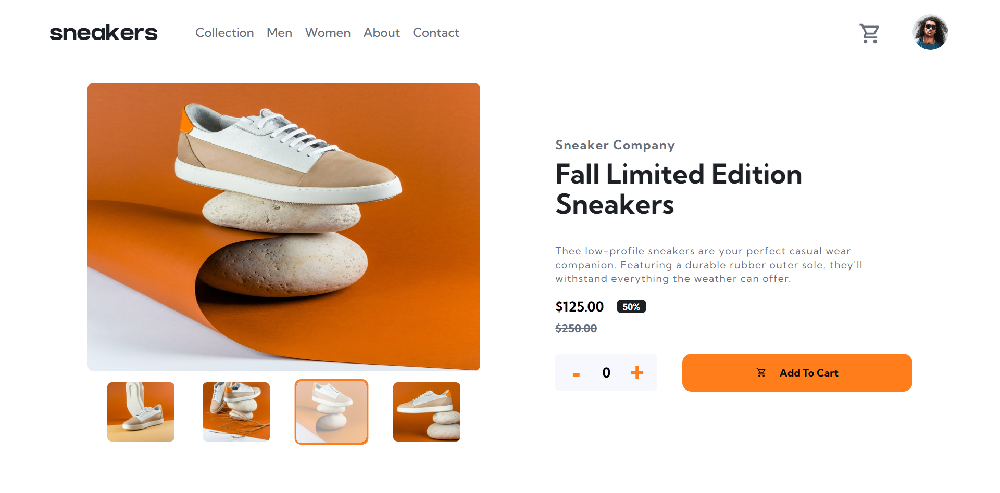
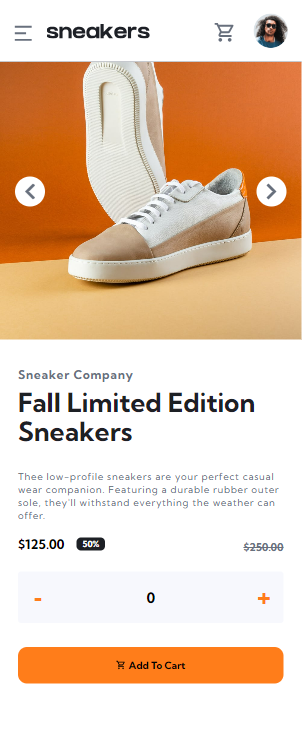

# Frontend Mentor - E-commerce product page solution

This is a solution to the [E-commerce product page challenge on Frontend Mentor](https://www.frontendmentor.io/challenges/ecommerce-product-page-UPsZ9MJp6). Frontend Mentor challenges help you improve your coding skills by building realistic projects.

## Table of contents

- [Overview](#overview)
  - [The challenge](#the-challenge)
  - [Screenshot](#screenshot)
  - [Links](#links)
- [My process](#my-process)
  - [Built with](#built-with)
  - [What I learned](#what-i-learned)
  - [Continued development](#continued-development)
- [Author](#author)

## Overview

### The challenge

Users should be able to:

- View the optimal layout for the site depending on their device's screen size
- See hover states for all interactive elements on the page
- Open a lightbox gallery by clicking on the large product image
- Switch the large product image by clicking on the small thumbnail images
- Add items to the cart
- View the cart and remove items from it

### Screenshot

### Links

- Solution URL: [https://www.frontendmentor.io/solutions/responsive-ecommerce-product-page-using-react-95NTd8PVeS](https://www.frontendmentor.io/solutions/responsive-ecommerce-product-page-using-react-95NTd8PVeS)
- Live Site URL: [https://ecommerceproductpagefrontend.netlify.app/](https://ecommerceproductpagefrontend.netlify.app/)

## My process

### Built with

- CSS custom properties
- Flexbox
- CSS Modules - For Styles
- [React](https://reactjs.org/) - JS library
- Taostify
- Context Api

### What I learned

Strong Grasp of context api handling data showing different layout based on different device. Different functionality. Making Navbar and different hovereffect. CSS Modules and many more

### Continued development

I will continue learning data handling and writing clean and maintainable code. React way of making sites and app. Will furthur add more functionality in this project

### Author

- Website - [@SudipKhatri](https://sudipkhatri.netlify.app/)
- Frontend Mentor - [@SudipKhatri036](https://www.frontendmentor.io/profile/SudipKhatri036)
- Linkedin - [@SudipKhatri](https://www.linkedin.com/in/sudip-khatri-a72a6a27b/)
